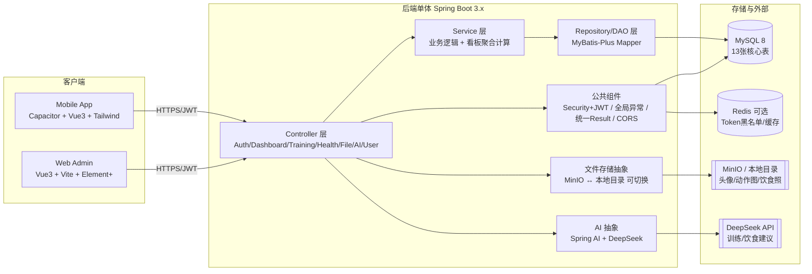

# FitPulse 项目架构与功能说明

---

## 一、项目概述

### 1.1 定位与用户群体

FitPulse 是一款**面向个人用户**的健康健身一体化 App，提供：
- 📱 **移动端 (Capacitor + Vue)**：日常训练打卡、身体数据记录、饮食与饮水、AI 顾问、个人中心 — Vue3 技术栈打包原生壳，一套代码双端复用
- 💻 **Web 管理后台**：维度看板、动作库/计划/记录全量 CRUD、饮食管理、AI 对话 — 适合 PC 端详细管理
- ⚙️ **Spring Boot 单体后端**：统一支撑双端，鉴权、训练/健康域、文件、AI 模块一体化

与商业产品不同，FitPulse **刻意精简**：
- 不做社区、社交、排行榜
- 不做多用户角色权限（单账号，个人使用）
- 不做微服务拆分（单体部署，MySQL + 可选 Redis，文件存储可降级本地）

### 1.2 单体架构设计理念

```
┌─────────────────────────────────────────────────────────────┐
│                     Spring Boot 单体                         │
│  ┌─────────┐ ┌──────────┐ ┌──────────┐ ┌────────────────┐  │
│  │  Auth   │ │ Training │ │  Health  │ │ File / AI / User│  │
│  └────┬────┘ └────┬─────┘ └────┬─────┘ └───────┬────────┘  │
│       │           │            │                │           │
│  ┌────▼───────────▼────────────▼────────────────▼────────┐  │
│  │              MyBatis-Plus / Spring Security / JWT     │  │
│  └────┬───────────┬─────────────┬──────────────┬─────────┘  │
│       │           │             │              │            │
│     MySQL 8    Redis(可选)    MinIO(本地可)   DeepSeek API  │
└─────────────────────────────────────────────────────────────┘
```

- **部署简单**：`java -jar fitness-backend.jar` + Nginx 前端静态页 + 一个 MySQL 实例即可跑通全量功能
- **中间件降级**：Redis 不可用时，Token 黑名单、缓存可走内存 ConcurrentHashMap；MinIO 不可用时，文件落本地磁盘 + Spring MVC 静态映射
- **前后端完全独立**：通过 `/api/v1/**` + JWT 解耦，移动端 与 Web 共用同一套接口契约

---

## 二、整体架构图（Mermaid）



**数据流向要点：**

1. 双端登录 → `/auth/login` → Spring Security 校验密码 → 签发 JWT
2. 看板加载 → `/admin/dashboard/training` 或 `/health` → Service 聚合多张表 → 按重点维度（训练B/C、健康A/B）计算后返回
3. 训练提交 → `/training/records` → Service 累加 `workout_set` → 回写 B 维度的 `total_volume / total_sets / total_reps` → 看板下次加载即时生效
4. 文件上传 → `/file/upload` → `FileStorageService`（按配置选 MinIO 或 本地）→ 写 `file_resource` 表 → 返回 URL
5. AI 对话 → `/ai/chat` → Spring AI ChatClient → DeepSeek → 流式/一次性返回

---

## 三、三端功能模块清单

### 3.1 移动端（Capacitor + Vue，用户日常使用）

> 采用 Capacitor 将 Vue3 Web 工程打包为原生壳应用，一套代码同时输出 Android / iOS 安装包。开发期间以浏览器 + 移动端设备模拟为主，发布时通过 Capacitor 执行 `npx cap sync` 同步到原生工程。

**BottomNav 四主Tab：**

| Tab | 功能点 | 重点维度 |
|---|---|---|
| **训练看板** (Home) | 本周容量/组数/次数大号高亮卡、连续天数、周完成率徽章、7天容量折线、每日明细列表 | **B（容量/组/次）+ C（趋势）** |
| **健康看板** (Health) | 体重/体脂大号卡+30天趋势、今日热量/饮水量+线性饮水进度条、蛋白质摄入文本、7天摄入柱状图 | **A（体重/体脂）+ B（摄入/饮水）** |
| **AI 顾问** (Ai) | 对话气泡 UI（用户/AI 左右对齐）、快捷入口（训练计划建议、饮食建议、恢复建议） | — |
| **个人中心** (Profile) | 用户资料卡（头像占位/昵称/ID）<br>▶ 训练记录<br>▶ 身体数据（录入体重/体脂）<br>▶ 饮食记录（食物库选择+自定义）<br>▶ 我的目标（目标体重/体脂/周训练次数/饮水/热量）<br>▶ 设置（密码修改、清除缓存、关于）<br>▶ 退出登录 | — |

**Capacitor 原生能力桥接：**
- `@capacitor/preferences` 替代 SharedPreferences：安全持久化 token
- `@capacitor/camera` 调用系统相机：头像/动作图/饮食照拍摄
- `@capacitor/haptics` 触觉反馈：训练打卡、达成目标时震动
- `@capacitor/status-bar` 状态栏样式：沉浸式配色
- `@capacitor/splash-screen` 启动屏：品牌展示

**项目结构（基于已落地的高保真原型）：**
```
fitness-mobile/
├── src/
│   ├── api/          # Axios 封装，统一 Bearer 拦截 + 401 跳登录
│   ├── components/   # 卡片/进度条/图表等通用组件
│   ├── mock/         # 原型阶段假数据，联调后剔除
│   ├── router/       # Vue Router 路由守卫
│   ├── stores/       # Pinia：token / userInfo
│   ├── styles/       # Tailwind 全局样式
│   ├── utils/        # 工具函数
│   └── views/        # login / training / health / ai / profile 五大页面
├── android/          # Capacitor 生成的 Android 工程
├── ios/              # Capacitor 生成的 iOS 工程（如需）
└── capacitor.config.ts
```

### 3.2 Web 管理后台（PC 深度管理）

| 页面 | 功能 |
|---|---|
| 登录页 | 用户名/密码表单、Loading、错误提示、注册入口 |
| 训练看板 | 训练B/C四卡（容量/组/次/训练次数）+ 周完成率徽章 + 近7天容量ECharts折线 + 每日明细表 |
| 健康看板 | 体重/体脂卡 + 30天趋势折线 + 摄入/饮水卡 + 饮水进度条 + 7天摄入ECharts柱图 + 蛋白质 |
| 动作库管理 | 表格 + 增删改 Dialog + 分类/难度筛选 + 图片上传预览 |
| 训练计划 | 计划列表 + 动作关联排序（拖拽序号）+ 目标组/次/休息设置 |
| 训练记录 | 按日期筛选 + 分页表格 + 详情Drawer（组明细RPE/重量/次数） |
| 身体数据 | 录入Form + 历史表格 + 体重/体脂双轴趋势图 |
| 饮食管理 | 食物库Tab + 记录Tab + 记录时选食物+克重自动算热量/三大营养素 + 图片 |
| 饮水日志 | 当日时间线 + 快速+200ml / +500ml 按钮 |
| AI 对话 | 左侧会话列表 + 右侧消息流 + Markdown渲染回复 |
| 个人中心 | 资料表单 + 目标Tab + 密码修改Tab |

### 3.3 后端模块（按包划分）

```
com.fitpulse.app
├── FitnessApplication.java          # @SpringBootApplication + @EnableAsync + @MapperScan
├── auth
│   ├── controller/AuthController    # 注册/登录/刷新/登出
│   └── jwt/                         # JwtTokenProvider / JwtAuthFilter / JwtProperties / CurrentUser注解
├── admin
│   └── controller/DashboardController  # 训练/健康两个看板（B/C + A/B维度）
├── training
│   ├── controller/TrainingController
│   ├── mapper/       # ExerciseMapper / WorkoutPlanMapper / WorkoutRecordMapper / WorkoutSetMapper
│   └── service/      # 训练提交时自动回写容量统计
├── health
│   ├── controller/HealthController
│   ├── mapper/       # BodyMetricMapper / FoodMapper / MealRecordMapper / WaterLogMapper
│   └── service/      # 热量自动换算 / 饮水累加
├── user
│   └── controller/UserController    # 资料+目标+密码
├── file
│   ├── controller/FileController    # multipart上传
│   └── service/FileStorageService   # MinIO ↔ 本地 双实现
├── ai
│   ├── controller/AiController
│   └── service/AiService            # Spring AI ChatClient 封装
├── common
│   ├── result/       # Result / ResultCode / PageResult
│   ├── exception/    # BusinessException + GlobalExceptionHandler
│   └── config/       # Security + Cors + MyBatisPlus + Redis + MinIO + AiPromptProperties
```

---

## 四、技术选型与职责对照表

| 依赖 | 版本 | 作用 |
|---|---|---|
| **Spring Boot Starter Web** | 3.2.x | MVC 基础、JSON序列化、Tomcat容器 |
| **Spring Boot Starter Validation** | 3.2.x | `@Valid` 参数校验 |
| **Spring Boot Starter Security** | 3.2.x | 密码BCrypt、过滤器链、401/403 |
| **MyBatis-Plus Boot Starter** | 3.5.5 | 单表CRUD零SQL、雪花ID、自动填充、逻辑删除、分页插件 |
| **MySQL Connector J** | 8.0.x | JDBC驱动 |
| **Lettuce (Redis)** | 6.x | Token黑名单 / 热点数据缓存（可选） |
| **MinIO SDK** | 8.5.x | 对象存储 S3兼容（个人版可关闭→走本地目录） |
| **JJWT (api/impl/jackson)** | 0.12.x | JWT 签发与校验 (HS256) |
| **Spring AI OpenAI / Spring AI Common** | 1.0.0-M2+ | 多模型客户端抽象，底层接 DeepSeek（兼容OpenAI协议） |
| **Hutool** | 5.8.x | 工具集（文件/日期/正则/Bean） |
| **Lombok** | 1.18.x | @Data / @Builder / @RequiredArgsConstructor 减样板代码 |
| — | — | **Vue3 前端** |
| **Vue + Vue Router + Pinia** | 3.4 / 4 / 2 | 核心框架 + 路由 + 状态（token/userInfo） |
| **Vite + @vitejs/plugin-vue** | 5.x | 构建、HMR、代理 /api → :8080 |
| **Element Plus** | 2.5.x | UI组件库（表单/表格/Dialog/ECharts容器） |
| **Axios** | 1.6.x | 请求拦截加 Bearer、响应拦截统一错误提示 + 401跳登录 |
| **ECharts + vue-echarts** | 5.5.x | 看板折线/柱图（训练容量7天、体重30天、摄入7天等） |
| **@element-plus/icons-vue** | 2.3.x | 图标 |
| **sass** | 1.70.x | SCSS 预处理器 |
| — | — | **移动端 (Capacitor + Vue)** |
| **Vue 3 + Vue Router + Pinia** | 3.4 / 4 / 2 | 与 Web Admin 同栈，组件/工具可跨端复用 |
| **Vite + @vitejs/plugin-vue** | 5.x | 构建、HMR、移动端设备模拟调试 |
| **Tailwind CSS** | 3.4.x | 原子化样式，移动端布局与响应式断点 |
| **Capacitor Core** | 6.x | Web → 原生壳：Android/iOS 工程生成与同步 |
| **@capacitor/preferences** | 6.x | 安全 KV 存储：替代 SharedPreferences 持久化 token |
| **@capacitor/camera** | 6.x | 调用原生相机/相册：头像/动作图/饮食照 |
| **@capacitor/haptics** | 6.x | 触觉反馈：训练打卡、目标达成震动提示 |
| **@capacitor/status-bar** | 6.x | 状态栏样式控制：沉浸式配色 |
| **@capacitor/splash-screen** | 6.x | 启动屏：品牌展示 |
| **Axios** | 1.6.x | 请求拦截加 Bearer、响应拦截统一错误提示 + 401 跳登录 |
| **ECharts + vue-echarts** | 5.5.x | 看板折线/柱图（训练容量7天、体重30天、摄入7天等），与 Web Admin 一致 |
| **Dexie.js (IndexedDB)** | 4.x | 浏览器端离线缓存：训练记录/身体指标弱网兜底 |

---

## 五、核心业务流程

### 5.1 注册 → 登录 → 进入看板

```
用户打开Web/移动端
    │
    ▼
[注册] POST /auth/register {username, password, email?}
    → 后端 BCrypt 加密 → 写 user + user_profile + 默认 user_goal
    │
    ▼
[登录] POST /auth/login {username, password}
    → Security UsernamePasswordAuthenticationToken
    → BCrypt 比对
    → JwtTokenProvider：生成 access(24h) + refresh(30d)
    → Pinia + Capacitor Preferences / Pinia 持久化 token
    │
    ▼
 路由跳转
    Web：/dashboard/training
    移动端：BottomNav 训练看板 Tab
```

### 5.2 训练记录 → B 维度容量统计 → C 维度趋势更新

```
用户录入训练（选计划/自由动作 + 多组：重量x次数）
    │
    ▼
POST /training/records {planId?, recordDate, durationSec?, note, sets:[{exerciseId,setNo,weightKg,reps,...}]}
    │
    ▼
TrainingService：
    1. insert workout_record (totalVolume/Sets/Reps先=0)
    2. 批量 insert workout_set (每一组明细)
    3. 累加计算:
         total_volume = Σ(set.weightKg × set.reps)  ← B维度重点
         total_sets   = count(sets)                   ← B维度重点
         total_reps   = Σ(set.reps)                   ← B维度重点
    4. updateById(workout_record) 回写统计字段
    │
    ▼
 下次加载训练看板时：
    DashboardService
      → 7天内 workout_record 聚合 (B)
      → completion_rate = (actual_workouts / user_goal.weekly_workouts) (C)
      → 每日容量 List<DailyVolume> 给折线图 (C)
```

### 5.3 身体数据录入 → A 维度趋势

```
用户录入：体重 + 体脂（可选：肌肉/腰围/BMI自动算）
    │
    ▼
POST /health/body-metrics
    → body_metric 表插入一条（record_date=当天, 若当天已存在则update）
    │
    ▼
健康看板加载：
    latest_weight      = 最新一条.weight_kg          ← A
    latest_body_fat    = 最新一条.body_fat_pct       ← A
    weight_trend_30d   = 近30天每天最新一条序列 → 折线图 ← A
```

### 5.4 饮食 + 饮水 → B 维度热量/饮水进度

```
[饮食] POST /health/meals {mealType, foodId?, foodName, quantityG, ...}
    食物库 → kcal_per_100g × quantityG/100 = total_kcal
    三大营养素同样按比例自动换算 → meal_record 落库 ← B

[饮水] POST /health/water {amountMl}
    water_log 追加一条 ← B

健康看板加载：
    calories_today = SUM(meal_record.total_kcal) WHERE 今天 ← B
    water_today_ml = SUM(water_log.amount_ml) WHERE 今天   ← B
    饮水进度条 = water_today_ml / user_goal.daily_water_ml  ← B可视化
    calories_last_7d = 近7天每日摄入序列 → 柱状图         ← B
```

### 5.5 文件上传流程

```
前端选择图片 → multipart/form-data POST /file/upload (bucket=avatar/exercise/food)
    │
    ▼
FileStorageService：
  if (storage.type == MINIO)：
      minioClient.putObject(bucket, objectKey, inputStream)
      fileUrl = minioEndpoint + /bucket/objectKey + 预签名(可选)
  else (LOCAL)：
      new File(uploadPath/bucket/yyyy/MM/dd/uuid.ext).write(inputStream)
      fileUrl = /files/bucket/yyyy/MM/dd/uuid.ext  (MVC映射)
    │
    ▼
写 file_resource 表 → 返回 {id, fileUrl}
    │
    ▼
用户端：头像URL / 动作图片URL / 饮食图片URL
```

### 5.6 AI 对话流程

```
用户在Web或移动端输入问题 + 可选 conversationId
    │
    ▼
POST /ai/chat {message, conversationId?}
    │
    ▼
AiService：
   Spring AI ChatClient (以 DeepSeek兼容OpenAI协议配置 base-url + api-key)
   → prompt 前缀：(SystemPromptProperties) 你是 FitPulse 健身顾问...
   → chatClient.prompt(message).call().content()
   (可选：会话上下文存入 Redis 或 conversationId 拼接历史)
    │
    ▼
 返回 {reply, conversationId} → 前端渲染气泡 / Markdown
```

---

## 六、开发顺序与里程碑

> 推荐按契约驱动（Schema 冻结 → API 冻结 → 三端并行开发）。

| 阶段 | 交付物 | 完成标准 |
|---|---|---|
| **Phase 1 · 契约与骨架** ✅ | 设计契约.md + 架构说明 + 后端工程 + Web骨架 + 移动端 Vue 原型骨架 + 首次推送 | 三端工程能启动/可编译，接口清单与DDL在设计契约中冻结（当前阶段已完成） |
| **Phase 2 · 鉴权与基础CRUD** | 后端：用户注册登录全流程 + 训练模块4个接口 + 健康模块4个接口 + 文件上传接口的完整Service实现；Web：登录页 + 列表页CRUD Demo；移动端：登录→跳首页鉴权通过 | MySQL跑 schema.sql → Postman 全量接口单测通过；Web登录成功进入路由；移动端 Capacitor Preferences token 持久化后重启免登录 |
| **Phase 3 · 看板 + 图表** | 后端 Dashboard 两个接口的聚合计算逻辑（B/C + A/B重点维度）；Web 看板四卡 + ECharts 三折线 + 饮水进度；移动端 看板四卡 + ECharts 折线/进度 | 用假数据能渲染出重点颜色高亮、图表点、徽章、进度条百分比 |
| **Phase 4 · AI + 文件** | AiService 接入 DeepSeek API Key；FileStorageService 本地/MinIO 双实现；Web AI 对话气泡；移动端 AI Bubble；头像/动作图/饮食照上传落地（@capacitor/camera） | 一次完整对话回合完成；头像设置后三端同步显示 |
| **Phase 5 · 移动端交互联调** | Home/Health/Ai/Profile 四屏全量 UI；Dexie.js 离线缓存 + 弱网显示；训练记录、身体数据录入表单；饮水快速按钮；退出登录清除数据；Capacitor 打包 Android APK 真机运行 | 真机/模拟器独立运行一周：所有功能从登录→录入→看板显示全链路闭环 |
| **维护 · 个人使用** | 密码修改、目标设置、日志滚动、数据备份 SQL 导出脚本 | 日常使用无Bug |

---

## 七、本地启动指南

### 7.1 数据库初始化

```sql
-- MySQL 8.0
CREATE DATABASE IF NOT EXISTS fitpulse DEFAULT CHARSET utf8mb4 COLLATE utf8mb4_unicode_ci;
USE fitpulse;
SOURCE D:/FitPulse/fitness-backend/src/main/resources/sql/schema.sql;
-- （可选）预置动作库/食物库：系统级 is_system=1 记录
```

### 7.2 后端启动

前置：JDK 17 + Maven 3.9+

```
cd D:\FitPulse\fitness-backend

# 修改 application.yml 本地配置项：
#   spring.datasource.url / username / password
#   fitpulse.storage.type=LOCAL     # 个人使用不用装 MinIO
#   fitpulse.upload.path=D:/FitPulseData/files
#   spring.ai.openai.api-key=sk-xxx  # 申请 DeepSeek，base-url=https://api.deepseek.com

mvn spring-boot:run
# 成功日志：
# ========== FitPulse 后端启动成功 http://localhost:8080 ==========
```

健康检查：`GET http://localhost:8080/api/v1/auth/login` 返回 401（未登录）证明服务正常。

### 7.3 Web 管理后台启动

前置：Node.js 18+

```
cd D:\FitPulse\fitness-web-admin
npm install
npm run dev
# 浏览器访问 http://localhost:5173
# Vite 已配置代理 /api → http://localhost:8080
```

### 7.4 移动端调试（Capacitor + Vue）

前置：Node.js 18+；打包 APK 时另需 Android Studio + JDK 17

**阶段一：Web 开发期（日常高频）**
```
cd D:\FitPulse\fitness-mobile
npm install
npm run dev
# 浏览器访问 http://localhost:5174
# 通过浏览器 DevTools 切换为移动端设备模拟（iPhone / Pixel 尺寸）
# Vite 已配置代理 /api → http://localhost:8080
```
此阶段即可完成 90% 的 UI 与业务联调，无需打开 Android Studio。

**阶段二：Capacitor 原生壳联调（涉及原生能力时）**
```
# 1. 添加 Android 平台（首次执行）
npm install @capacitor/core @capacitor/cli @capacitor/android
npx cap init "FitPulse" "com.fitpulse.app" --web-dir=dist
npx cap add android

# 2. 构建前端 Web 资源并同步到原生工程
npm run build
npx cap sync android

# 3. 用 Android Studio 打开生成的原生工程
npx cap open android
#   → 选择模拟器或真机，点击 Run 'app'
```
原生壳内访问宿主机后端：模拟器使用 `http://10.0.2.2:8080/api/v1/`；真机改为 PC 局域网 IP（如 `http://192.168.1.10:8080/api/v1/`），并在 `capacitor.config.ts` 的 `server.url` 或环境变量中配置。

**阶段三：原生能力调用排查**
- `@capacitor/preferences`、`@capacitor/camera` 等插件仅在原生壳内生效，浏览器中调用会回退到 Web 实现；调试此类 API 时必须走阶段二。
- Chrome DevTools 支持 inspect 模拟器/真机中的 WebView：`chrome://inspect/#devices`。

### 7.5 文件存储降级说明

个人使用无需安装 MinIO：在 `application.yml` 里设置：
```yaml
fitpulse:
  storage:
    type: local   # 1=minio 2=local 的数字对应枚举，读代码注释
    upload-path: D:/FitPulseData/files
```
本地文件通过 `http://localhost:8080/files/<bucket>/...` 访问。